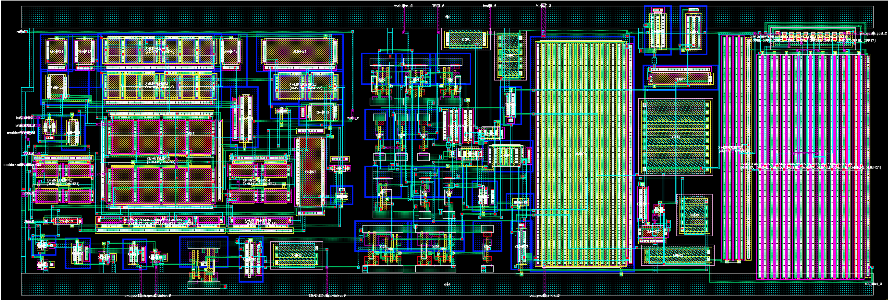

# Hello World!, I'm Amal Antony, a Electronics and Eelctrical Engineer 👋🏼:
🛜 currently working on my own PLL layout and design 👨🏼‍🎓 graduated with Masters in Electrical and Computer Engineering 📚 Proficient in Analog Layout and UVM verification 

# 💻 Tech Stack:
     " srcset="https://raw.githubusercontent.com/tobiasmeyhoefer/tobiasmeyhoefer/output/github-snake-dark.svg" />
  <source media="(prefers-color-scheme: light)" srcset="https://raw.githubusercontent.com/tobiasmeyhoefer/tobiasmeyhoefer/output/github-snake.svg" />
  
</picture>

<h1 align="left">Hey 👋 What's up?</h1>

###

My name is ... and I'm a ..., from ....

###

<h2 align="left">About me</h2>

###

✨ Creating bugs since ... 📚 I'm currently learning ... 🎯 Goals: ... 🎲 Fun fact: ...

###

<h2 align="left">I code with</h2>

###

  
  
  
  
  
  
  
  
  
  
  
  
  
  
  

###
